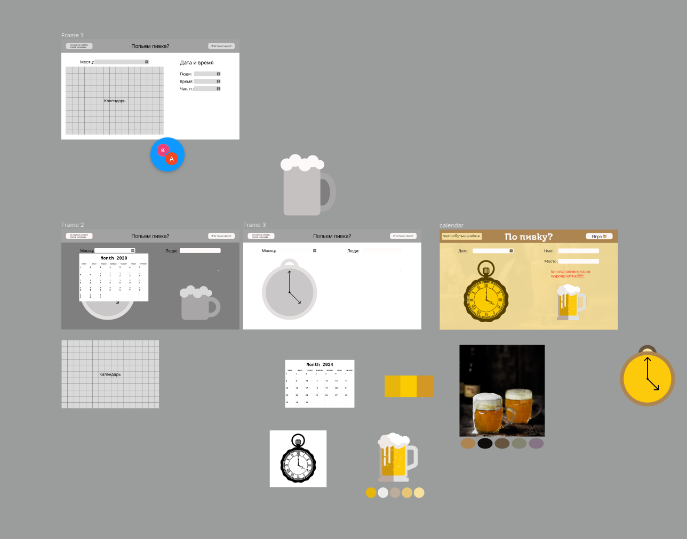
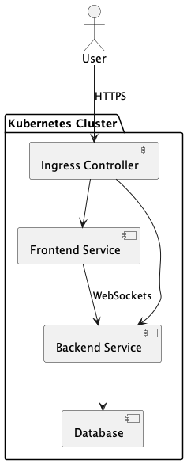

# Описание идеи 

Часто трудно встретиться с друзьями - все заняты или не могут опеределиться с местом, куда пойти. Решение проблемы вдохновлено этим сайтом. Однако, там есть несколько проблем: нет возможности выбрать место, нельзя посмотреть, кто проголосовал за конкретную дату и время, нет "привлекательности" (лично я не хочу заходить на тот сайт, чтобы соглаосвать что-то, какой-то он строгий)

Тема пива выбрана далеко не случайно, она используется как wildcard для произвольной активности будь то поход в кино, бар, библиотеку или дельфинарий. Просто все любят пиво, так или иначе. К тому же это отличная возможность добавлять юмор (судя по недавним исследованиям, актуальность шуток про пиво строго возрастает)

# Структурная схема  (неформально)

1. В простых случаях без rate-limit'а и с единственным для пользователя endpoint'ом достаточно использовать ingress. 

2. Бэкэнд и фронтэнд разворачиваются на разных нодах, что позволяет масштабировать их независимо. Для взаимодействия используются WebSockets, в частности для постоянного обновлени пользовательского интерфейса. 

3. Кластер базы данных разворачивается в кластере k8s строго в тестовых и учебных целях. Очевидная проблема такого подхода - относительно низкая производительность при высокой нагрузке.

В качестве ingress контроллера - HAProxy. [Тут есть замеры](https://habr.com/ru/articles/900438/), показывает себя стабильно и относительно легко разворачивается 

Front-, backend на React.js + GoLang. Значения не имеет. 

Для базы данных есть ограничение - NoSQL. Это связано с потенциальными частыми изменениями схемы на начальных этапах разработки. Кажется, dynamodb работает в среднем быстрее, но для PoC задач и возможного написания аналитических запросов используется mongoDB (производительностью пренебрегаем). Так как сервис предполагает планирование преимущественно на ближайшую неделю - можно добавить cache-aside redis кластер рядом с кластером базы данных.

При необходимости, можно развернуть elasticsearch для поиска по базе данных. 

# Структурная схема

1. Общее описание

Цель системы :
Создание удобного инструмента для организации личных встреч, мероприятий и событий между друзьями и близкими людьми. Сервис позволяет согласовывать дату, время, место и учитывать предпочтения участников.

Основные компоненты :

Фронтенд - SPA, React.js
Бэкенд - REST API + микросервисы
Уведомления - Telegram API
MongoDB — основная база данных
Redis — кэширование
== 

В качестве брокера сообщений (при необходимости) - RabbitMQ, в качестве S3-compatible - MinIO (в том числе для добавления новых функциональных компонент)

2. Сценарии использования 

- Регистрация - Пользователь регистрируется через email или соцсети
- Создание события - Создание нового события с названием, временем и местом (ссылка на сервис карт)
- Приглашение друзей - Выбор пользователей для приглашения на событие (можно использовать Telegram )
- Получение уведомлений - Telegram сообщение за 1 час до события
- Поиск событий	- по дате, времени и месту 

3. Роли

- Гость - регистрация, просмотр мест, даты и времени мероприятий
- Пользователь - создание событий

4. Протоколы

HTTPS, WebSockets, RESP (Redis)

Для обеспечения безопасности: JWT token, rate limit

5. DevOps

K8s, ArgoCD, Terraform IaC, JMeter для нагрузочного тестирования

6. Вертикальное масштабирование

- Поддержка разного уровня мощности серверов
- Использование SSD для БД
- Использование serverless для фоновых задач (например, уведомлений)